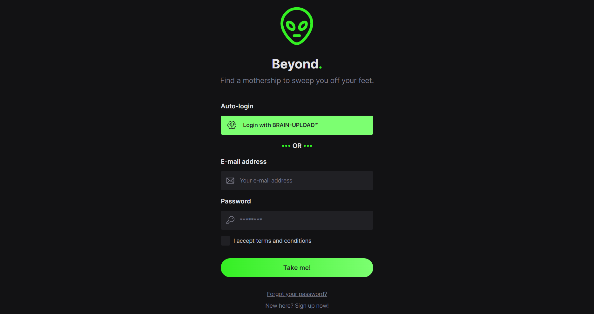

# Beyond.: dating app for aliens 👽

>PT-BR

Projeto de website e de design-system realizado durante o 3º [Ignite Lab](https://app.rocketseat.com.br/event/ignite-lab-04/) da [Rocketseat](https://app.rocketseat.com.br). 
Decidi fazer um tema de aplicativo de relacionamento para alienígenas.

🔗 [Clique aqui para ver o app 👽❤️👽](https://ignite-lab-design-system-nine.vercel.app)  
🔗 [Clique aqui para ver os componentes do projeto](https://mariak-fla.github.io/ignite-lab-design-system)

>EN-US

Website and design-system project made during [Rocketseat's](https://app.rocketseat.com.br) third [Ignite Lab](https://app.rocketseat.com.br/event/ignite-lab-04/) event. 
I've decided to make mine into a dating platform for aliens.

🔗 [Clique here to see the app 👽❤️👽](https://ignite-lab-design-system-nine.vercel.app)  
🔗 [Click here to see the project's components](https://mariak-fla.github.io/ignite-lab-design-system)

## ⚙️ Languages/Linguagens

- HTML
- Git
- Github
- JavaScript
- React
- TypeScript
- Radix-ui
- Node
- TailwindCSS